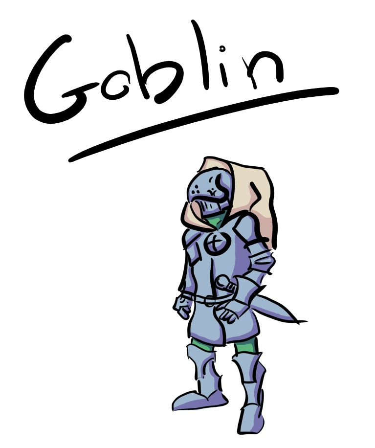

# Enemies

**Enemies**, like **players** can have **armor**, **weapons**, **shields**, and any other abilities that a player might have. This makes even standard enemies potentially difficult to defeat.

- **Armor** protects an enemy from various types of attacks which land upon it. If a **slash** type sword strikes against **chainmail** for instnace, the attack will deal little to no damage. However, chainmail would not be a good defense against weapons that **pierce**, such as a **rapier** or a **spear**.

## Armored Goblin Example

This **Armored Goblin** is covered head to toe in **Plate Armor**. However, notice that there are three **exposed** areas on the goblin. 

- Neck
- Right Leg
- Left Leg

The player may tell decide where to aim a blow. If the player already knows about an enemy's weak points or **observes** them, they can use this to their advantage. If the player does not already know this, and is unable to observe it, they may still choose where to aim the blow, taking the chance that they're aiming for an exposed area.